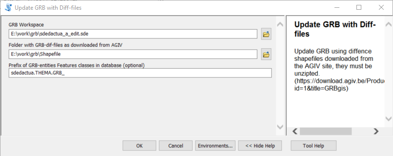

Update GRB 
----------

Update GRB using diffence shapefiles downloaded from the AGIV site. (https://download.agiv.be/Producten/Detail?id=1&title=GRBgis)

You can use it as a commandline tool form the updateGRB.py file:

    usage: updateGRB.py [-h] [--GRB_WORKSPACE GRB_WORKSPACE]
                        [--GRB_UPDATE_DIR GRB_UPDATE_DIR]
                        [--GRB_PREFIX GRB_PREFIX]

    optional arguments:
      -h, --help            show this help message and exit
      --GRB_WORKSPACE GRB_WORKSPACE
                            the GRB workspace to update
      --GRB_UPDATE_DIR GRB_UPDATE_DIR
                            the folder that cntians the GRB diff-files
      --GRB_PREFIX GRB_PREFIX
                            The prefix the GRB_documents have in the database,
                            optional but recommended, default 'GRB_'

Or you access the the tool as ArcGIS-toolbox using the GRB_Update.pyt files.
